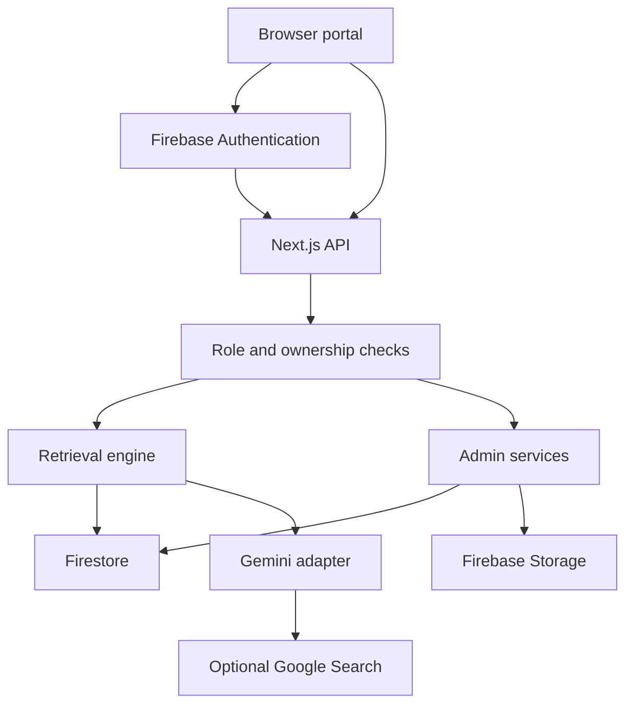
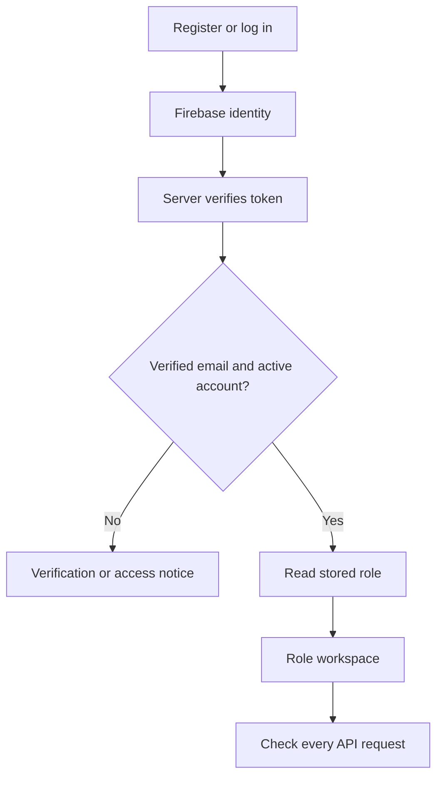
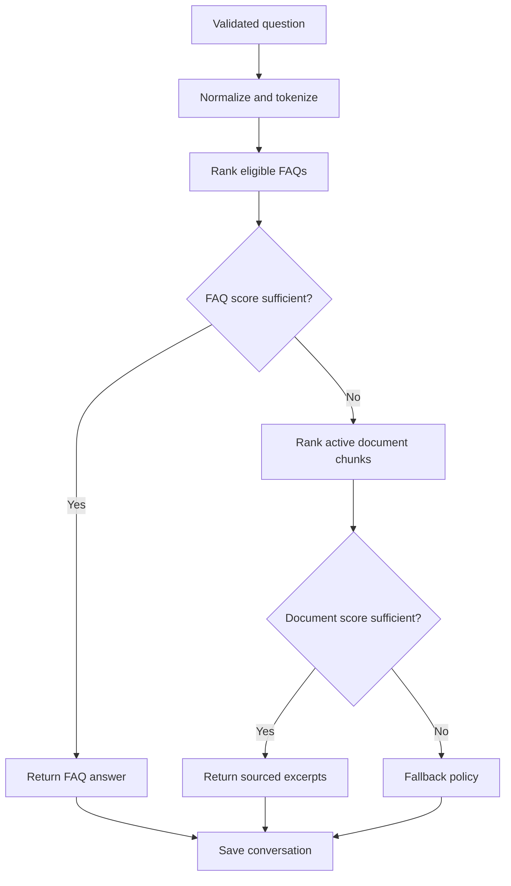
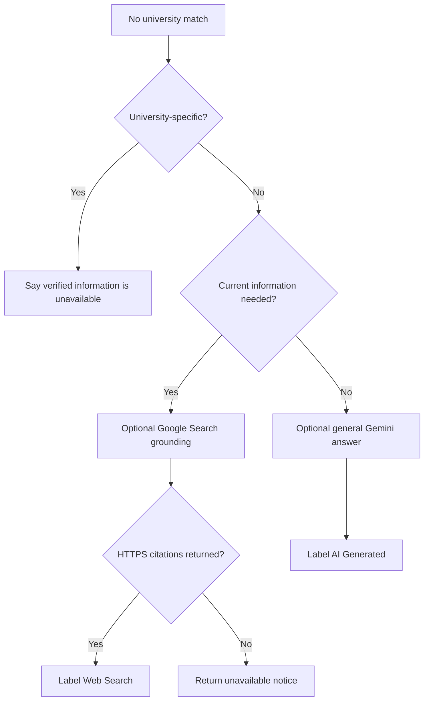
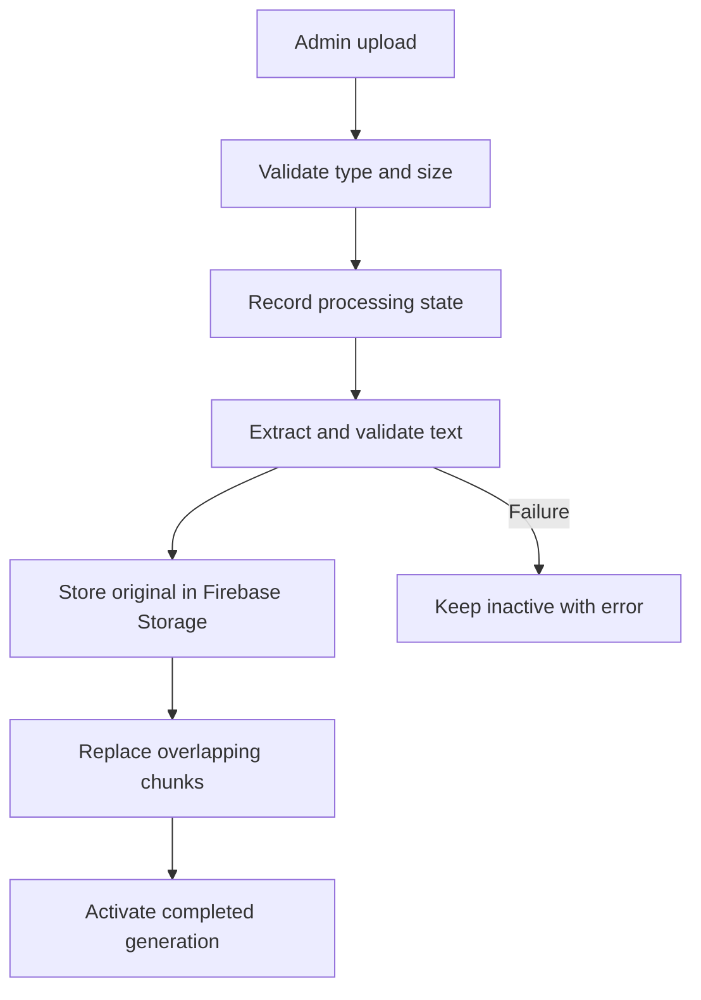

# Architecture

The browser uses Firebase Auth and sends its ID token to a Next.js Node API. The API verifies the token and current account status/role, then accesses Firestore and Storage through a server service account. Secrets never enter the client bundle. Client route guards improve navigation; API authorization is the security boundary.

## Authentication

An initial profile is created transactionally as student. A faculty request is metadata, not permission. Password reset and verification use Firebase email flows. Role/status changes require admin access and a transaction retaining at least one active admin. First-admin creation is a trusted local script.

## Chat and FAQ retrieval

Normalization applies English/Roman Urdu campus synonyms and phrase mappings at read time. Ranking searches content, document title/name, category, tags and keywords. It combines TF-IDF cosine (25%), canonical keyword coverage (25%), local semantic concept coverage (35%), title match (8%), category match (4%) and phrase match (3%). Exact normalized FAQ questions retain precedence. This is a deterministic concept layer, not a learned embedding model.

Evidence gates require query subjects/modifiers to be present and requested facets (requirements, amounts, dates, hours or schedules) to be supported in answer content. Metadata alone cannot establish these facets. Default FAQ/document thresholds remain 0.55/0.48; invalid settings fall back to those defaults, with a minimum effective threshold of 0.4. Audience and active-state filtering precede ranking, and the API still checks ready document generations. Up to three nonduplicate excerpts retain document/chunk provenance. Excerpts remain verbatim; multiple excerpts receive source labels. No document content is sent to Gemini. See [retrieval details](retrieval.md).

## Fallback

Only the current question reaches the external provider. Search text is untrusted data under a fixed system instruction. No external tools can execute code or modify the app. Suspected instruction overrides are declined before retrieval. Heuristic topic/injection detection is not a proof against every adversarial phrasing; general AI outputs remain labeled and need human review for consequential use.

## Document ingestion

Reprocessing disables retrieval first. Generation matching prevents partial/stale chunks being served. Deleting a source disables it, removes its chunks and stored file, then removes metadata. Admins can retry failed operations.

## Admin management

Admin changes are validated and audited. FAQ changes are immediately available on the next retrieval request. Document records expose processing status. Unresolved queries can be turned into an FAQ and marked resolved after a verified answer is authored. Analytics derive from stored records rather than made-up counters. Conversation review is a separate opt-in with an audit entry.

Deployment uses a single Next.js application with Firebase services. No microservices, paid vector database or queue is required for the FYP corpus. The current full-corpus scan and synchronous ingestion are documented scaling boundaries.
